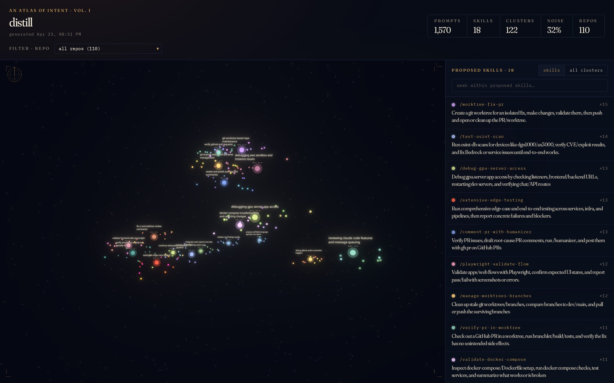
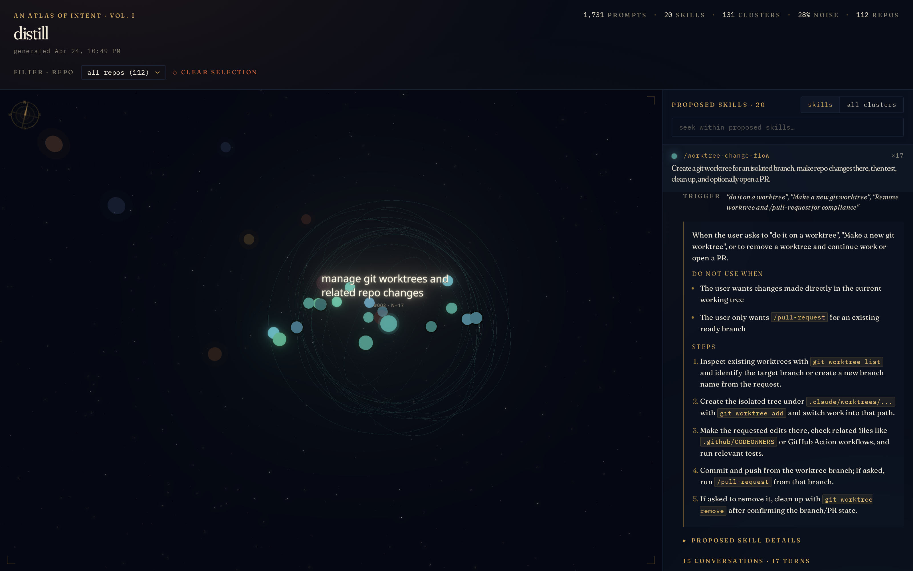

# distill

Reads your Claude Code conversation history and proposes personal skills for
the workflows you repeat.



## What it does

Walks `~/.claude/projects/*.jsonl`, embeds every user prompt, clusters them,
asks an LLM whether each cluster is a real recurring workflow, and drafts a
[Claude Code skill](https://platform.claude.com/docs/en/agents-and-tools/agent-skills/overview)
when it is. Skills already in `~/.claude/skills/` get filtered out by a
shape-aware similarity check. Each accepted proposal includes a trigger, an
"avoid when" clause, and concrete steps that cite your actual commands and
file paths.

The UI is an observatory: every accepted skill is a sun, every prompt is a
planet around its cluster. Click a planet to open the original conversation
at that turn.



## Run it

```bash
bun install

# default: local Ollama (Qwen3.6-27B chat + qwen3-embedding:8b)
ollama pull qwen3-embedding:8b
ollama pull Qwen/Qwen3.6-27B
bun run pipeline
bun run dev   # → http://localhost:5173
```

Hosted models work too:

```bash
# OpenAI (chat + embeddings on the same API)
CCC_PROVIDER=openai OPENAI_API_KEY=… bun run pipeline

# OpenAI Codex variant (gpt-5.3-codex via Responses API)
CCC_PROVIDER=codex OPENAI_API_KEY=… bun run pipeline

# Anthropic chat + OpenAI embeddings (Anthropic has no embeddings endpoint)
CCC_CHAT_PROVIDER=anthropic ANTHROPIC_API_KEY=… \
CCC_EMBED_PROVIDER=openai   OPENAI_API_KEY=…   \
  bun run pipeline
```

Override the defaults with `CCC_CHAT_MODEL` / `CCC_EMBED_MODEL`.

## How a cluster becomes a skill

1. Extract user prompts from every JSONL session. Drop confirmations and the system-injected wrapper tags Claude Code adds.
2. Embed each prompt. Default is OpenAI `text-embedding-3-large`.
3. UMAP into 2D, then HDBSCAN. A second HDBSCAN pass at a tighter `min_cluster_size` runs over the noise points and recovers small but coherent patterns the first pass dropped.
4. A separate session-level clustering runs over whole-session intent text. This catches workflows whose individual prompts vary in phrasing but whose sessions look alike.
5. A cluster has to clear several gates to reach the LLM: at least 3 sessions, at least a 3-day span, no single session contributing more than 75% of the prompts, and fewer than two "this session is being continued" markers in the exemplars. Without those gates, one-shot weekend projects look like recurring skills.
6. The judge (gpt-5.4 by default) reads the exemplars and either rejects the cluster or drafts the SKILL.md body.
7. Accepted proposals get a second pass: cosine similarity over the proposal shape (name + description + trigger + avoid-when + body), then a single LLM consolidation call to catch near-duplicates that cosine missed.
8. Anything still alive is checked against `~/.claude/skills/`. If a proposal's workflow shape is too close to an installed skill, it gets dropped.

Pipeline outputs (`packages/pipeline/data/*`) are `.gitignored` since they
contain personal conversation content. Run the pipeline locally to regenerate.
